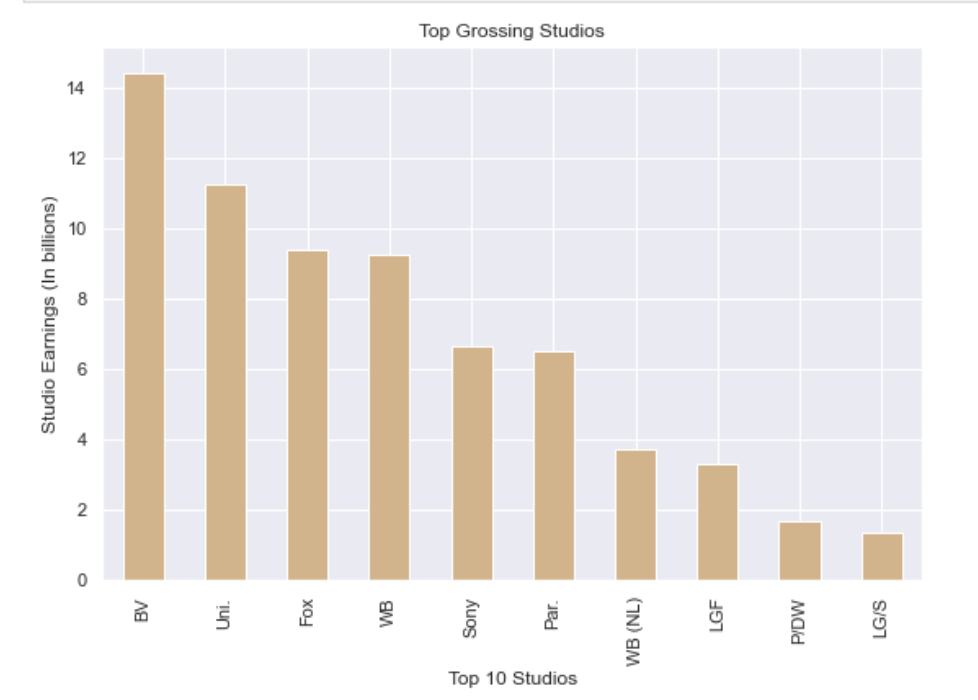
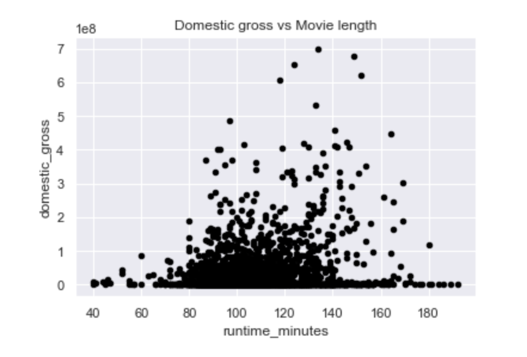
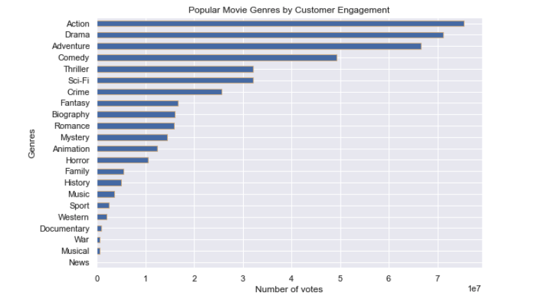

# Microsoft Movie Analysis

**Author**: Marissa Bush

## Overview

Data analysis gives insight on what successful movie studios are doing well and what specific actions Microsoft can do to achieve similar aims.

## Business Problem

Microsoft seems all the big companies are creating original video content, and they want to get in on the fun. They have decided to create a new movie studio, but they don't know anything about making movies. You are charged with exploring what types of films are currently doing the best at the box office. You must then translate those findings into actionable insights that the head of Microsoft's new movie studio can use to help decide what type of films to create.

In order to address this problem I asked the following questions:

1.  How many films have the top studios made from 2010-2019, and which studio brings in the most earnings? In other words, what are the studios that will be Microsoft's biggest competition?

2. Is there a positive correlation between film length and domestic gross?

3. What are the most popular movie genres?

The first question is appropriate from a  business perspective because it is essential to understand the current competition in the business industry. Next, it is interesting to see if there are any positive or negative correlations with specific actions - indicating whether or not Microsoft should move in a particular direction. Finally, what type of films Microsoft should invest in. For example, "What are the films that have stood out and why have they stood out?". These queries will help create an actionable map that Microsoft can use to build a successful studio.

## Data

Three data sets were used for this business problem - box office mojo movie gross, IMDB title basics, and IMDB title ratings data. This data was taken from the following three csv files: 

+ data/zippedData/bom.movie_gross.csv.gz
+ data/zippedData/imdb.title.basics.csv.gz
+ data/zippedData/imdb.title.ratings.csv.gz

The data represents movie data from 2010-2019, including domestic gross, titles, genres, ratings, and movie length. The target variable ... The properties of the variables I intend to use are domestic gross: sum, genres: number of occurrences, genres versus domestic gross. 

## Methods

The descriptive analysis of this data consisted of first collecting the data by converting the csv files into data frames and then combining those data frames into one. The second step consisted of cleaning the data by checking for duplicates, missing values, dropping unnecessary columns, renaming columns, and finally, dropping any outliers. Finally, the third step consisted of reviewing the previous questions and using visualizations to find the answers. For the visualizations, I chose to use primarily scatter plots and bar graphs.

## Results

The results for the previous questions are as follows:

Question 1. The most productive studios from 2010-2019 have made over 80 films in that time with Buena Vista studios bringing in the highest earnings.

Question 2. It looks like this shows the higher grossing films were in the 2 - 2.5 hour range. Perhaps making a film that length would be a good move.

Question 3. Results show drama, action, and comedy are the most frequently made movies and that action films result in a lot more online engagement compared to the other genres. Results also seem to show that sport, documentary, and music come out as the top three genres with the highest ratings. However, this would be inaccurate to conclude due to the low number of votes for those particular genres. In summary, it looks like action, drama, and comedy genres are the most successful, with audiences with action coming first.


### Visual 1


### Visual 2


### Visual 3


## Conclusions

With this in mind, I would recommend Microsoft to make a movie that is between 2 to 2.5 hours long and also to consider a film in the action, drama, or comedy genre. Additionally, I would recommend making about 8.8 films a year in order to compete with the top studios. This analysis has gaps due to the small data set and only including domestic gross as a measure of earnings. To improve this project, I would like to work with foreign gross and cost of production data to understand the bigger picture of potential earnings per film. 


## For More Information

Please review the full analysis in [my Jupyter Notebook](https://github.com/Marissa841/Movie-Analysis/blob/main/dsc-phase1-microsoft-movie-analysis.ipynb) or the [presentation](./DS_Project_Presentation.pdf).

For any additional questions, please contact **Marissa Bush, marissabush.02@gmail.com**

## Repository Structure

```
├── README.md                           <- The top-level README for reviewers of this project
├── dsc-phase1-microsoft-movie-analysis.ipynb   <- Narrative documentation of analysis in Jupyter notebook
├── DS_Project_Presentation.pdf         <- PDF version of project presentation
├── data                                <- Both sourced externally and generated from code
└── images                              <- Both sourced externally and generated from code
```
